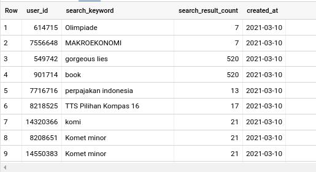
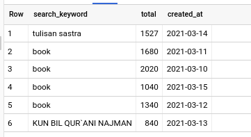
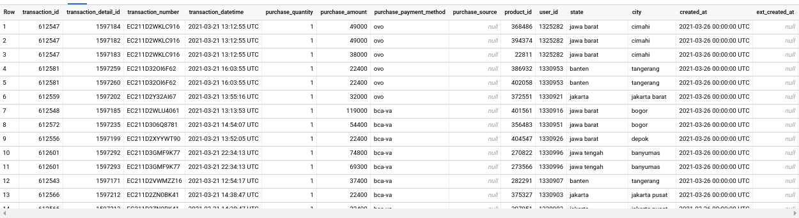

# GCP-ETL

We're going to set up a Google Cloud Composer
environment and solve several **batch-processing** cases
by creating DAGs to run ETL jobs in the cloud. The data
processing consists of ETLs with data going in and from
GCS to BigQuery and the other is BigQuery to PostgreSQL

## Project Overview
We have two kind of task at hand here.

1. Move data from several csv files in Google Cloud Storage to BigQuery

2. Transform transactional events from the unified user events bigquery
table, into a transaction table in bigquery. Then move it to PostgreSQL

## Tech Stack
We're going to use some services from Google Cloud Platform here:
1. Google Cloud Storage (GCS)
2. Google Cloud Dataflow
3. Google Cloud Composer
4. BigQuery
5. Cloud SQL

## Installation
1. Create your [Project](https://cloud.google.com/dataflow/docs/quickstarts/quickstart-python#before-you-begin)
2. Setup [Google Composer Environment](https://cloud.google.com/composer/docs/quickstart#creating_an_environment)
3. Put `dags` and `dataflow_function` folder into your composer's bucket
4. Setup Composer Variable using the example in `config/env-example.json`

## Result

# Glossary

## Batch Processing
Batch processing is the processing of transactions in a group or batch. No user interaction is required once batch processing is underway. This differentiates batch processing from transaction processing, which involves processing transactions one at a time and requires user interaction.

Put simply, batch processing is the process by which a computer completes batches of jobs, often simultaneously, in non-stop, sequential order. It’s also a command that ensures large jobs are computed in small parts for efficiency during the debugging process.

While batch processing can be carried out at any time, it is particularly suited to end-of-cycle processing, such as for processing a bank's reports at the end of a day or generating monthly or biweekly payrolls.